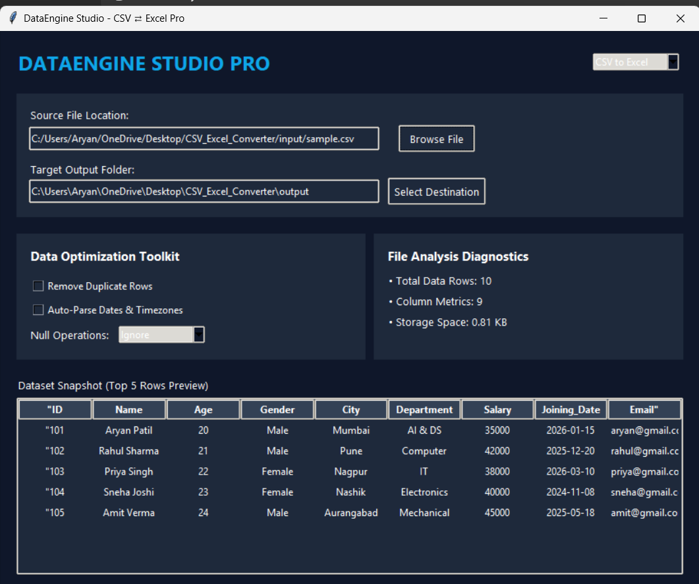

# 📊 CSV ⇄ Excel Converter

<p align="center">

**A Professional Python + Tkinter Desktop Application for Seamless CSV and Excel File Conversion**

Convert **CSV → Excel (.xlsx)** and **Excel (.xlsx) → CSV** with an intuitive graphical interface, real-time dataset preview, logging, and file validation.

</p>

---

## ✨ Features

- 🔄 Convert **CSV → Excel (.xlsx)**
- 🔄 Convert **Excel (.xlsx) → CSV**
- 🖥️ Modern Tkinter GUI
- 📂 Browse input files
- 📁 Choose custom output folder
- 📊 Dataset preview (Top 5 rows)
- 📈 File statistics
- 🧹 Remove duplicate rows *(Optional)*
- 📅 Date parsing support *(Optional)*
- ⚠️ Error handling & validation
- 📝 Automatic logging
- ⚡ Fast conversion using Pandas

---

# 🖼️ Application Preview

## Main Application



## Dataset Preview


---

# 🛠️ Tech Stack

| Technology | Purpose |
|------------|---------|
| Python 3.14 | Programming Language |
| Tkinter | Desktop GUI |
| Pandas | Data Processing |
| OpenPyXL | Excel File Handling |
| Logging | Application Logs |
| OS Module | File Management |

---

# 📂 Project Structure

```
CSV_Excel_Converter/
│
├── screenshots/
│   ├── home.png
│   └── analysis.png
│
├── input/
│   └── sample.csv
│
├── output/
│
├── logs/
│
├── converter.py
├── gui.py
├── logger.py
├── main.py
├── requirements.txt
├── README.md
└── .gitignore
```

---

# 🚀 Installation

### Clone Repository

```bash
git clone https://github.com/Aryanpatil-svg/CSV_Excel_Converter.git
```

### Move into Project

```bash
cd CSV_Excel_Converter
```

### Install Required Packages

```bash
pip install -r requirements.txt
```

### Run Application

```bash
python main.py
```

---

# 📋 Requirements

- Python 3.10+
- Pandas
- OpenPyXL

Install manually if needed:

```bash
pip install pandas openpyxl
```

---

# 📖 How to Use

### CSV → Excel

1. Launch the application.
2. Select **CSV to Excel** mode.
3. Browse and choose a CSV file.
4. Select an output folder.
5. Click **Convert**.
6. The Excel file will be created automatically.

---

### Excel → CSV

1. Select **Excel to CSV** mode.
2. Choose an Excel (.xlsx) file.
3. Select destination folder.
4. Click **Convert**.
5. CSV file will be generated successfully.

---

# 📊 Sample Dataset

A sample dataset is included inside the **input/** directory for testing purposes.

Example fields:

- ID
- Name
- Age
- Gender
- City
- Department
- Salary
- Joining Date
- Email

---

# ⚙️ Error Handling

The application automatically handles:

- Invalid file paths
- Unsupported file formats
- Empty files
- Missing values
- Read/Write exceptions
- Conversion failures

Detailed logs are stored inside the **logs/** folder.

---

# 📌 Future Improvements

- Drag & Drop Support
- Batch File Conversion
- Password Protected Excel Files
- Custom Column Mapping
- Dark/Light Theme
- Progress Bar
- Export History
- Data Cleaning Options

---

# 🤝 Contribution

Contributions, suggestions, and improvements are welcome.

1. Fork the repository
2. Create a new branch
3. Commit your changes
4. Push the branch
5. Create a Pull Request

---

# 📄 License

This project is created for educational and internship purposes.

---

# 👨‍💻 Author

**Aryan Patil**

🔗 GitHub: https://github.com/Aryanpatil-svg

---

⭐ **If you found this project useful, consider giving it a Star on GitHub!**
